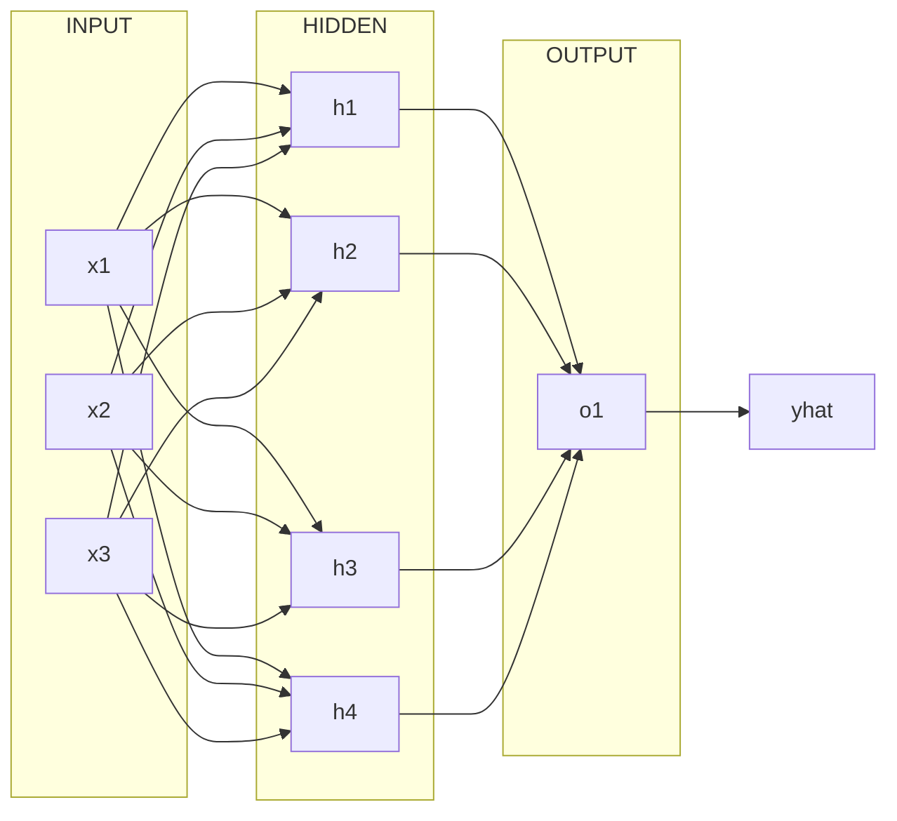

# Neural Networks and Deep Learning: Week 3 - Notes

## Shallow Neural Networks 

### Neural Networks Overview

Notation

- Compared to the single node of a Logistic Regression, we will now combine nodes into layers.
  - We need to be able to distinguish between a layer and an example
    - Layer 
      - A superscripted number inside brackets will indicate a layer designation
      - $z^{[1]} = W^{[1]}x + b^{[1]}$
        - $z$, $W$, and $b$ belong to the first layer of the network 
    - Example 
      - A superscripted number inside parenthesis will indicate a training example 
      - $x^{(1)}$
        - The first training example 

### Neural Network Representation

