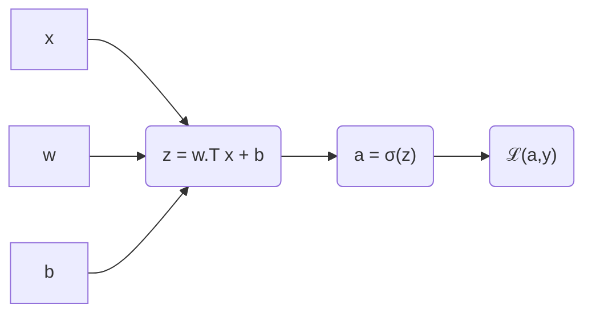
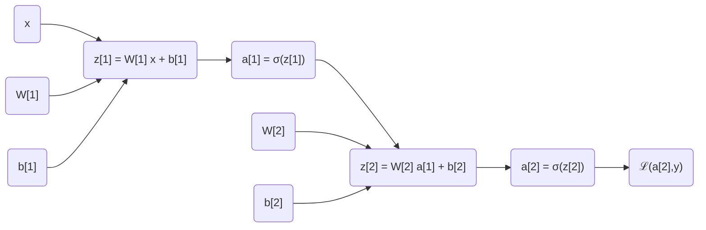

# Neural Networks and Deep Learning: Week 3 - Notes

## Shallow Neural Networks 

### Neural Networks Overview

Notation

- Compared to the single node of a Logistic Regression, we will now combine nodes into layers.
  - We need to be able to distinguish between a layer and an example
    - Layer 
      - A superscripted number inside brackets will indicate a layer designation
      - $z^{[1]} = W^{[1]}x + b^{[1]}$
        - $z$, $W$, and $b$ belong to the first layer of the network 
    - Example 
      - A superscripted number inside parenthesis will indicate a training example 
      - $x^{(1)}$
        - The first training example 

### Neural Network Representation

Diagram 

- Input Layer
  - The input layer consists of a vector of input data 
  - $a^{[0]} = x$
    - The $a$ refers to the activations of the input layer 
      - The components of $x$ that pass data into the hidden layer 
- Hidden Layer 
  - The intermediate, hidden layers of the network 
  - $a^{[1]}$
    - $a^{[1]}$ is a $m×1$ matrix where each row represents a node in the layer
    - The components of $a^{[1]}$ are identified with notation $a{^{[1]}}{_i}$, where $i$ is the specific node in the layer
  - Each layer is associated with values of $w$ and $b$
    - $a^{[1]}$ is associated with $w^{[1]}$ and $b^{[1]}$
      - $w^{[1]}$ will be $m×n$ where $m$ is the number of nodes in the layer and $n$ is the number of inputs
      - $b^{[1]}$ will be $m×1$ where $m$ is the number of nodes in the layer
- Output Layer 
  - The layer responsible for outputting $\hat{y}$
  - $a^{[2]}$
  - $\hat{y} = a^{[2]}$

### Computing a Neural Network's Output 

Two Layer Neural Network 

- Given input $x$
  - $z^{[1]} = W^{[1]}x + b^{[1]}$
    - Note $W^{[1]}$ is an $m×n$ matrix where
      - $m$ is the number of nodes in the layer 
      - $n$ the number of inputs
      - Each row of $W$ represents the corresponding $w^T$
  - $a^{[1]} = σ(z^{[1]})$
    - Note $a^{[1]}$ is an $m×1$ matrix where
      - $a$ is the activation output for each node
  - $z^{[2]} = W^{[2]}a^{[1]} + b^{[2]}$
  - $a^{[2]} = σ(z^{[2]})$

### Vectorizing Across Multiple Training Examples

Output Notation 

- Given the same two-layered neural network as before, we seek to vectorize across training examples 
  - $a^{\[2](i)}$ denotes the output of layer 2, $\hat{y}$, for training example $i$

Training Example Matrix 

- Remember, we've constructed a matrix, $X∈ℜ^{n_x×m}$, where each column is an input vector 

Layer Matrices 

- Linear Result Matrix 
  - We construct a matrix $Z^{[1]}∈ℜ^{(n×m)}$ 
    - where 
      - $n$ is the number of nodes in the layer
      - $m$ is the number of training examples
- Weight Matrix 
  - We have $W^{[1]}∈ℜ^{(n×n_x)}$ 
    - where 
      - $n$ is the number of nodes in the layer
      - $n_x$ is the number of inputs
- Input Matrix
  - We have $X^{[1]}∈ℜ^{(n_x×m)}$ 
    - where 
      - $n_x$ is the number of inputs
      - $m$ is the number of training examples
- Bias Vector
  - We have $b^{[1]}∈ℜ^{(n×1)}$ 
    - where
      - $n$ is the number of nodes in the layer
- Activation Matrix
  - We have $A^{[1]}∈ℜ^{(n×m)}$ 
    - where 
      - $n$ is the number of nodes in the layer 
      - $m$ is the number of training examples

Vectorized Equations

- $Z^{[1]} = W^{[1]}X + b^{[1]}$
- $A^{[1]} = σ(Z^{[1]})$
- $Z^{[2]} = W^{[2]}A^{[1]} + b^{[2]}$
- $A^{[2]} = σ(Z^{[2]})$

### Vectorized Implementation Explanation

### Activation Functions 

Hyperbolic Tangent (tanh)

- Equation 
  - $a = tanh(z) = (e^z - e^{-z}) / (e^z + e^{-z})$
- A non-linear activation function with range -1..1 and $tanh(0)=0$
  - Helps to zero the function
- A scaled, shifted version of sigmoid
- Always better than sigmoid except for the output layer in binary classification 
  - You want sigmoid in this case to restrict the output to 0..1
- Downside
  - If $z$ is very large or small, the slope is close to $0$ which slows down learning

Rectified Linear Unit (ReLU)

- Equation 
  - $a = max(0, z)$
  - Note the derivative
    - 0 if negative, 1 if positive
    - Not well defined at 0, but 0 or 1 works well

Leaky Rectified Linear Unit (Leaky ReLU)

- Equation 
  - $a = max(0.01z, z)$
    - Adds a non-zero slope for negative values

Rules of Thumb

- Binary Classification 
  - If output is 0 or 1, use sigmoid 
- ReLU or Leaky ReLU
  - Use in all other cases

### Purpose of Non-Linear Activation Functions

Linear Activation 

- Identity Activation 
- $g(z)=z$
- The output of one layer is a linear function of the input
  - Regardless of the number of layers, the network is essentially calculating an activation function and not learning
  - If the output layer switches to sigmoid, the entire network is only as good as the output layer
- Potential advantage 
  - If you're seeking a real valued output, the output layer can use a linear activation function 
    - All other layers should be using ReLU

### Derivatives of Activation Functions 

Sigmoid 

- Equation 
  - $g(z) = (1 + e^{-z})^{-1}$
- Derivative 
  - $\frac{d}{dz}g(z) = (1+e^{-z})^{-1} (1 - (1+e^{-z})^{-1})$
  - $\frac{d}{dz}g(z) = g(z) (1 - g(z))$

Tanh 

- Equation 
  - $g(z) = tanh(z)$
- Derivative 
  - $\frac{d}{dz}g(z) = 1 - (tanh(z))^2$
  - $\frac{d}{dz}g(z) = 1 - g(z)^2$
- Note 
  - If $|z| ≥ 10$ then $g'(z)=0$ 

ReLU 
- Equation 
  - $g(z) = max(0,z)$
- Derivative 
  - $\frac{d}{dz}g(z) = 0 or 1$

Leaky ReLU 
- Equation 
  - $g(z) = max(0.01z,z)$
- Derivative 
  - $\frac{d}{dz}g(z) = 0.01 or 1$

  ### Gradient Descent for Neural Networks 

  Parameters

  - For a two-layer (one hidden layer) neural network 
  - $n_x = n^{[0]}$
  - $n^{[1]}$
  - $n^{[2]} = 1$
  - $W^{[1]}$
    - $(n^{[1]}, n^{[0]})$
  - $b^{[1]}$
    - $(n^{[1]}, 1)$
  - $W^{[2]}$
    - $(n^{[2]}, n^{[1]})$
  - $b^{[2]}$
    - $(n^{[2]}, 1)$

  Cost Function 

  - $J(W^{[1]}, b^{[1]}, W^{[2]}, b^{[2]}) = \frac{1}{m} ∑ℒ(\hat{y}, y)$
    - $\hat{y} = a^{[2]}$

  Gradient Descent 

- Repeat until convergence
  - Compute $\hat{y}$
  - $dW^{[1]} = \frac{d}{dW^{[1]}}J$
  - $db^{[1]} = \frac{d}{db^{[1]}}J$
  - $dW^{[2]} = \frac{d}{dW^{[1]}}J$
  - $db^{[2]} = \frac{d}{db^{[1]}}J$
  - $W^{[1]} = W^{[1]} - αdW^{[1]}$
  - $b^{[1]} = b^{[1]} - αdb^{[1]}$
  - $W^{[2]} = W^{[2]} - αdW^{[2]}$
  - $b^{[2]} = b^{[2]} - αdb^{[2]}$

Formulas for computing derivatives 

- Forward Propagation 
  - $Z^{[1]} = W^{[1]}X + b^{[1]}$
  - $A^{[1]} = g^{[1]}(Z^{[1]})$
  - $Z^{[2]} = W^{[1]}X + b^{[1]}$
  - $A^{[2]} = g^{[2]}(Z^{[2}) = σ(Z^{[2})$
    - Output layer will use sigmoid activation function
- Back Propagation 
  - $Y = [y^{(1)} ... y^{(m)}$
    - Ground truths
  - $dZ^{[2]} = A^{[2]} - Y$ 
  - $dW^{[2]} = \frac{1}{m} dZ^{[2]}A^{[1]T}$
  - $db^{[2]} = \frac{1}{m} np.sum(dZ^{[2]}, axis=1, keepdims=True)$
    - keepdims prevents a rank 1 vector as output
  - $dZ^{[1]} = W^{[2]T}dZ^{[2]} * g^{[1]}{'} (Z^{[1]})$ 
    - $*$ is an elementwise product
      - On either side is an $(n^{[1]} × m)$ matrix
  - $dW^{[1]} = \frac{1}{m} dZ^{[1]}X^T$
  - $db^{[1]} = \frac{1}{m} np.sum(dZ^{[1]}, axis=1, keepdims=True)$
    - $(n^{[1]} × 1)$ matrix

## Backpropagation Intuition 

### Logistic Regression:

Loss

- $ℒ(a,y) = -yloga -(1-y)log(1-a)$

Backpropagation Derivatives

- $da$
  - $da = \frac{d}{da}ℒ(a,y) = - \frac{y}{a} +  \frac{1-y}{1-a}$
- $dz$
  - $dz = \frac{dℒ}{dz} = \frac{dℒ}{da} \frac{da}{dz}= da * g'(Z)$ 
- $dw$
  - $dw = \frac{dℒ}{dw} = dz * x$
- $db$
  - $db = \frac{dℒ}{db} = dz$

### Two-Layer Neural Network

Backpropagation Derivatives 

- Second Layer
  - $dz^{[2]} = a^{[2]} - y$
  - $dW^{[2]} = dz^{[2]} a^{[1]}{'}$
  - $db^{[2]} = dz^{[2]}$
- First Layer 
  - $dz^{[1]} = W^{[2]}.T dz^{[2]} * g^{[1]}{'} (z^{[1]})$ 
    - $*$ is an elementwise product 
    - Dimensional Analysis 
      - $(n^{[1]},1) =(n^{[1]}, n^{[2]})(n^{[2]}, 1) * (n^{[1]}, 1)$
      - If things aren't working out in practice, make sure the dimensions are adding up
  - $dW^{[1]} = dz^{[1]}x.T$
  - $db^{[1]} = dz^{[1]}$

Vectorized Implementation 

- $dZ^{[2]} = A^{[2]} - Y$
- $dW^{[2]} = dZ^{[2]}A^{[1]T} / m$
- $db^{[2]} = \frac{1}{m} np.sum(dZ^{[2]}, axis=1, keepdims=True)$
- $dZ^{[1]} = W^{[2]T}dZ^{[2]} * g^{[1]}{'}(Z^{[1]})$
  - $*$ is an elementwise product 
- $dW^{[1]} = dZ^{[1]}X^T / m$
- $db^{[1]} = \frac{1}{m} np.sum(dZ^{[1]}, axis=1, keepdims=True)$
